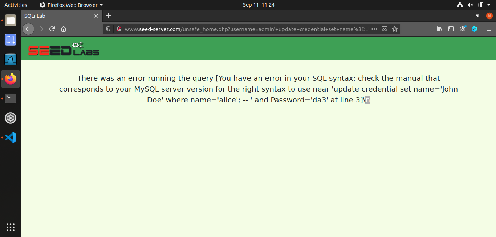

# TD1 - SQL INJECTION

## SQL Coding Review

```SQL
-- SQL Commands Reminder

-- SELECT statement
SELECT column1, column2 FROM table WHERE condition;

-- UPDATE statement
UPDATE table SET column1 = value1, column2 = value2 WHERE condition;

-- INSERT statement
INSERT INTO table (column1, column2) VALUES (value1, value2);

-- DELETE statement
DELETE FROM table WHERE condition;

-- JOIN (INNER JOIN as an example)
SELECT column1, column2
FROM table1
INNER JOIN table2 ON table1.column = table2.column;

-- SQL Injection Prevention Example
-- Use parameterized queries or prepared statements to prevent SQL injection.
-- Example in Python with SQLite:
import sqlite3
conn = sqlite3.connect("database.db")
cursor = conn.cursor()
lname = "Smith"
cursor.execute("SELECT * FROM customers WHERE last_name = ?", (lname,))
```
## SQL injections on SELECT statements

- from the webpage, our strategy is to insert SQL code into the inputs of our webpage, this will be done by using the single quote: " ' ". This will close the initial single quote that is open to insert our information and therefore we'll be able to insert SQL code right after. I have chosen to go with two options here:
    1. put a true statement in order for the sql statement to be true in all cases then comment the rest:
        ```SQL 
        ' or 1=1 --
        ```
    2. insert the name of a user then put -- to comment all the remaining code therefore all the SQL code that follows is commented thus making the password insignificant.
        ```SQL
        admin'; -- 
        ```
- first of all we inspect the behaviour of the login button, we deduce that the file retrieved when the button is clicked is unsafe_home.php, we insert in the link the same things we injected in the web and execute the curl command, for the link, we have to make sure that certain characters are URL-encoded so that they are interpreted correctly, space is indicated by a +:
    ```
    curl http://www.seed-server.com/unsafe_home.php?username=%27+or+1%3D1+--+&Password=
    ```
    or 
    ```
    curl http://www.seed-server.com/unsafe_home.php?username=admin%27%3B+--+&Password=
    ```
## Appending a new SQL statement
Trying to inject some text like admin’; UPDATE credential set Name=’John Doe’ WHERE
Name=‘Alice’;# the result is not as expected :

This attack is actually infeasible, as one can only perform a single request through the PHP
implementation. Actually, reading the PHP documentation of the query function (see for
instance https://www.php.net/manual/fr/pdo.query.php) shows that it is limited in scope.
However, if the multi_query function had been used instead, it would have been possible to
inject an UPDATE request with new data for instance.

## SQL injections on UPDATE statements
