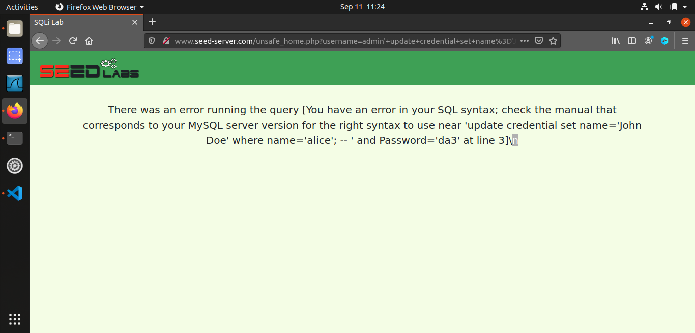
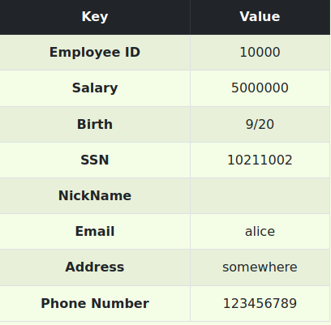
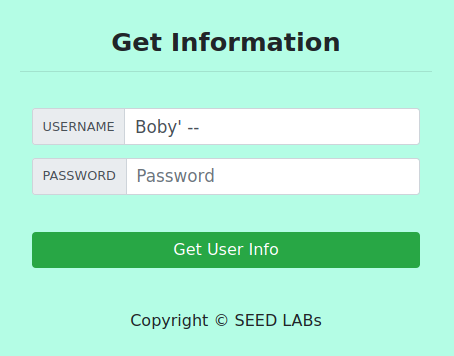
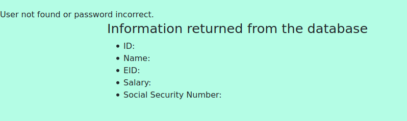
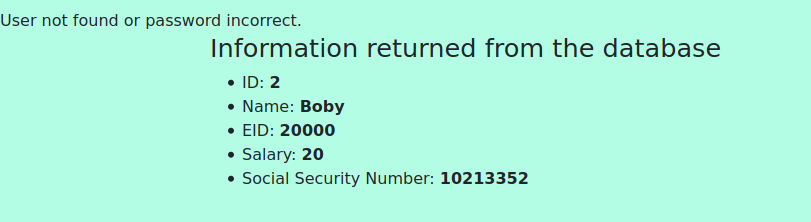

# TD1 - SQL INJECTION

## SQL Coding Review

```SQL
-- SQL Commands Reminder

-- SELECT statement
SELECT column1, column2 FROM table WHERE condition;

-- UPDATE statement
UPDATE table SET column1 = value1, column2 = value2 WHERE condition;

-- INSERT statement
INSERT INTO table (column1, column2) VALUES (value1, value2);

-- DELETE statement
DELETE FROM table WHERE condition;

-- JOIN (INNER JOIN as an example)
SELECT column1, column2
FROM table1
INNER JOIN table2 ON table1.column = table2.column;

```
## SQL injections on SELECT statements

- from the webpage, our strategy is to insert SQL code into the inputs of our webpage, this will be done by using the single quote: " ' ". This will close the initial single quote that is open to insert our information and therefore we'll be able to insert SQL code right after. I have chosen to go with two options here:
    1. put a true statement in order for the sql statement to be true in all cases then comment the rest:
        ```SQL 
        ' or 1=1 --
        ```
    2. insert the name of a user then put -- to comment all the remaining code therefore all the SQL code that follows is commented thus making the password insignificant.
        ```SQL
        admin'; -- 
        ```
- first of all we inspect the behaviour of the login button, we deduce that the file retrieved when the button is clicked is unsafe_home.php, we insert in the link the same things we injected in the web and execute the curl command, for the link, we have to make sure that certain characters are URL-encoded so that they are interpreted correctly, space is indicated by a +:
    ```
    curl http://www.seed-server.com/unsafe_home.php?username=%27+or+1%3D1+--+&Password=
    ```
    or 
    ```
    curl http://www.seed-server.com/unsafe_home.php?username=admin%27%3B+--+&Password=
    ```
## Appending a new SQL statement
Trying to inject some text like admin’; UPDATE credential set Name=’John Doe’ WHERE
Name=‘Alice’;# the result is not as expected :

This attack is actually infeasible, as one can only perform a single request through the PHP
implementation. Actually, reading the PHP documentation of the query function (see for
instance https://www.php.net/manual/fr/pdo.query.php) shows that it is limited in scope.
However, if the multi_query function had been used instead, it would have been possible to
inject an UPDATE request with new data for instance.

## SQL injections on UPDATE statements
- In order for Alice to commit the perfect crime she needs to make sure that only her salary is changed, this can be done with the following injection:
    ```sql
    ', salary='5000000' WHERE Name='Alice' -- 
    ```
    
- now we got Alice a higher salary, let's punish her stingy boss Boby, using the same injection:
    ```sql
    ', salary='20' WHERE Name='Boby'# -- 
    ```
- Modifying the password will require us to do an extra step as the hash value of the password is the one stored using the SHA1 function, therefore we must inject the hash value of the password we would like:
    - using the following command in our linux terminal we can determine the hash for our password, in this example we use "Alice":
        ```shell
        echo -n "Alice" | sha1sum
        ```
    Or we can directly use the SHA1(string) function in SQL
    - we inject this hash using the same technique
        ```sql
        ', password = SHA1('Alice') WHERE name='Boby'#
        ```
        we can see that Boby can only login if he puts Alice in his password box.

##  Countermeasure - prepared statement
Among the best countermeasures to SQL injections is using a prepared statement in your code. 

The loophole that is exploited in this attack is that code is mixed with data, so by tampering with data, we can bypass limiters like single or double quotes and introduce new code, the code is then compiled after being modified. 

Prepared statement basically compile our SQL code before injecting the data onto it using placeholders like '?', then the data is inserted right before execution.

the unsafe php code that allowed for the sql injections to occur is the following:
```php
$result = $conn->query("SELECT id, name, eid, salary, ssn
                        FROM credential
                        WHERE name= '$input_uname' and Password= '$hashed_pwd'");

```

we can see here that we can tamper with the query before it's compilation.

**the safe version should seperate the SQL code then execute it, then inject our data, here is a sample of how a prepared statement works after modifying the file [unsafe.php](./Labsetup/image_www/Code/defense/unsafe.php) :**

```php
$stmt = $conn->prepare("SELECT id, name, eid, salary, ssn
                        FROM credential
                        WHERE name = ? AND Password = ?");
$stmt->bind_param("ss", $input_uname, $hashed_pwd);
$stmt->execute();
$stmt->bind_result($id, $name, $eid, $salary, $ssn);
$stmt->fetch();
```

After attempting the following injection we fail:




Here is the information after logging on correctly:



Note that prepared statements are **not always the solution** as it only deals with static SQL queries with a fixed structure, this is because prepared statements can only be used to protect fields that are not needed during compilation.Therefore **we cannot use prepared statements in Column names, Table names, SQL operators or within an ORDER BY clause.**

There are other ways to deal with SQL injections in such cases, mainly ***Whitelisting***.