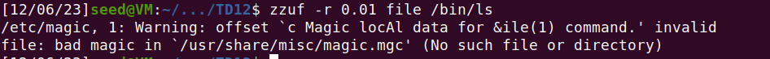
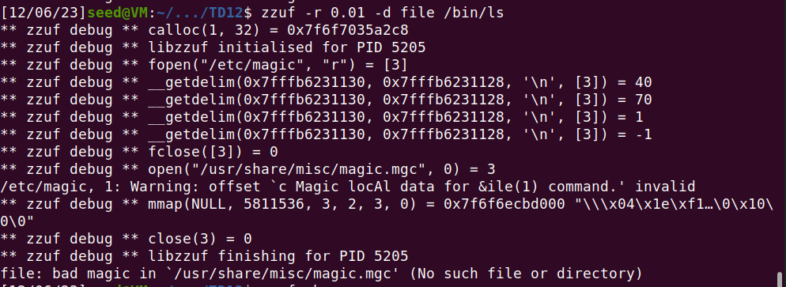
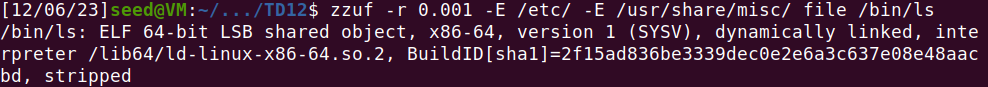
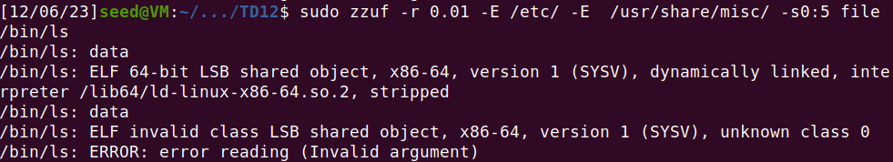

# TP 12 - security testing using fuzzers

## Fuzzing cat

```bash
zzuf -r 0.01 cat smiley.txt
```
This command executes `zzuf`, applying a 1% mutation ratio to `smiley.txt`, and pipes the fuzzed output to `cat` for display.
Meaning only around 1% of the input will be altered.
- when we execute that command we can see that the smiley face is slightly altered with the addition of non printable characters.
- when we change the command to a ratio of 10% mutation the text is even more altered. We can no longer see a smily face. due to the non printable characters

When omitting the non printable characters using the command:
`zzuf -r 0.1 -R '\x00-\x20\x7f-xff' cat smiley.txt`

- We still modify 10% of the input however we can still somewhat see the smily face.


## Fuzzing file


- The `file` command in Unix-like operating systems is used to determine the type of a given file in terms of the file content. When you run the command `file` followed by a path to a file, it performs a series of tests on the file to figure out what kind of data it contains.



- we get an error after trying to execute zuf on /bin/ls, that is due to the fact that file opens configuration files involving the input from which its properties are extracted.


- `file` uses /etc/magic, a configuration file used to determine the type of an input. the debug shows that /etc/magic was corrupted by the fuzzing, therefore file threw an error.
- we can use the option -E to exclude this file from the fuzzing process.



- the option `-s0:5` invokes the fuzzer 5 times randomly, generating 5 different results:


- The `-s0:5` option in `zzuf` triggers five runs with seeds 0 through 4, causing different pseudo-random number sequences for each run. Since `zzuf` uses these sequences to determine how it modifies the data at a 1% fuzzing ratio, each run produces slightly different modifications. This leads to varied outputs from the file command as it processes these distinct modified inputs.

## Fuzzing AntiWord

`zzuf -C 10 -q -s 0:1000 -r 0.001:0.02 -M 1000 antiword Text.doc`

- `-C 10`: Sets the crash threshold; `zzuf` will stop after 10 crashes are detected.
- `-q`: Enables quiet mode; minimizes the output produced by `zzuf`.
- `-s 0:1000`: Specifies the seed range; `zzuf` will use seed values from 0 to 1000 for its runs.
- `-r 0.001:0.02`: Defines the fuzzing ratio range; the data mutation will vary between 0.1% and 2%.
- `-M 1000`: Limits the memory usage; `zzuf` is constrained to use a maximum of 1000 megabytes of memory.
- `antiword`: The target program for fuzzing; in this command, it's `antiword`, a Word document processing tool.
- `Text.doc`: The input file; `antiword` will process the Word document `Text.doc` which is subject to fuzzing.
