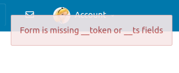

# Cross site request forgery - CSRF

## Task 2 - CSRF GET REQUEST:

this is the HTTP GET request that a user submit to add another user on elgg:

`http://www.seed-server.com/action/friends/add?friend=59`

what we'll do, is through a message or an email to alice, we'll redirect her to our website where we embed and thus execute that request using the :
```html

```
i encountered a problem with docker here, had to delete all previous images of the last labs

## Task 3 - POST REQUEST
 
This time our request is going to be POST, it's a bit different than the GET request as the modification is done in the HTTP request's body instead of the URL

view the code in the attacker folder for editprofile. I had issues with the browser in docker, took me 30 minutes to actually make the changes in my code work.

- Q1) Boby can access alice's guid through sending her a friend request or a message then inspecting the URL, there he can find he GUID
- Q2) Boby can launch this CSRF attack even without knowing the GUID of the user, he would need to get this GUID however through the DOM or cookies through javascript code like this :
    ```js
    var guid = document.getElementById('userGuidElement').value; // Hypothetical element containing user's GUID
    ```

## Task 4 - DEFENCE
### secret tokens
When a user logs in, the server generates a unique secret token linked to the user's session. This token is embedded into forms or AJAX requests as a hidden field or header on the webpage.

For each subsequent request, like submitting a form, the browser includes this token, and the server verifies it before processing the request. Since the token is unique and unpredictable, an attacker cannot forge cross-site requests as they can't know or obtain the user’s token. If the token is missing or incorrect, the server rejects the request.

These tokens can be paired with timestamps to limit their validity period. It ensures that even if an attacker intercepts a token, they cannot use it after a certain period. These mechanisms together ensure that the request is genuine, comes from an authenticated and authorized source, and is timely, adding robust security layers against CSRF attacks.

Remember to keep these tokens secure; they should be transmitted over HTTPS to prevent eavesdropping and potential theft. Implementing this mechanism requires server-side logic to create, distribute, and verify tokens, as well as client-side code to include the tokens in requests.

### implementation
Why Attackers Can't Use These Tokens:
Uniqueness & Session Bound:

The tokens are unique to each user session. An attacker, without having access to the user’s current session, can’t know or predict these tokens.
Dynamic Generation:

Tokens are dynamically generated. Even if an attacker manages to get a token, it won’t be valid for a different session or after a certain period.
Absence of Cross-site Reading Ability:

CSRF is a write-based vulnerability. Attackers can make users send requests but can't read the response. Since they can’t read responses due to same-origin policy restrictions, they can’t extract these tokens from web pages.
So, when this countermeasure is on, secret tokens embedded in HTTP requests ensure an additional layer of security, making CSRF attacks ineffective because attackers can't access or replicate these tokens effectively. The users' interactions are validated to be genuine and intentional, ensuring security against unauthorized actions.




## Task 5 : 

### 1. Observations and Explanations

- **Link A:** All types of cookies (`cookie-normal`, `cookie-lax`, and `cookie-strict`) are sent to the server because it is a same-site request.
- **Link B:** Only `cookie-normal` and `cookie-lax` are sent, excluding `cookie-strict`. This is due to the cross-site nature of the request initiated from a different domain.

#### Why Some Cookies Are Not Sent

- **SameSite Attribute:** The SameSite cookie attribute plays a crucial role here. It dictates whether a cookie should be sent with cross-site requests or not.
- **Strict vs. Lax:** 
    - `cookie-strict` is not sent in cross-site requests due to its `SameSite=Strict` attribute.
    - `cookie-lax` is sent even in cross-site requests as it has a `SameSite=Lax` attribute, allowing it in top-level navigations.

### 2. Role of SameSite Cookies in Identifying Request Origin

- **Lax Cookies:** Sent with top-level navigations, helping identify requests that aren’t embedded within third-party contexts.
- **Strict Cookies:** Restricted to first-party contexts, not sent with any third-party or cross-site requests, offering a stringent security level.

### 3. Utilizing SameSite Cookies to Defend Against CSRF in Applications

- **Session Cookies:** Mark these as SameSite to ensure they aren’t sent along with cross-site requests.
    - E.g., `Set-Cookie: SID=31d4d96e407aad42; Path=/; SameSite=Strict`

- **Authentication Tokens:** Use SameSite attribute for cookies containing tokens to secure user sessions and identity.
- **Choosing the Right SameSite Attribute:** 
    - `Strict` for higher security in sensitive areas of the application.
    - `Lax` where some level of cross-site interactions is permissible and needed for user experience.

- **Browser Compatibility:** Ensure the implementation supports a variety of browsers as SameSite attribute handling can vary.
