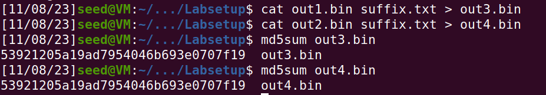
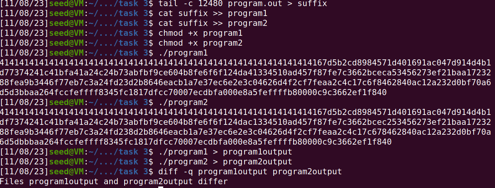

# Cryptographic hash functions lab

## Task 1 

1. If the size of the prefix file is not a multiple of 64 bytes, it is then padded to be of that size when plugged in at the start of out1.bin and out2.bin

2. A prefix file of a size 64 bytes means that there will be zero padding, which is what we observe.

3. the files are mostly identical, except for certain characters.

## Task 2

As we have seen, out1.bin and out2.bin have the same hashes, therefore we can add a suffix to them, and we see that the hash for the two files is identical now as well.

## Task 3

after inspecting the generated binary file, we can see that the array is located in the offset 0x3020 which is 12320 in decimal, 12352 is the next number divisible by 64, which will be in offset 0x3040.
the prefix will be from the start till the offset 0x3040.
the 128 byte region will be between 0x3040 and 0x30bf and the suffix will be from 0x30c0 aka 12480 till the rest of the executable.

this decomposition allows to do the following:
- extract a prefix that will allow us to generate two different programs using the md5collgen
- then add the suffix of the initial program to complete the binary files
- thus we have two different programs with the same hashcodes

## Task 4 

Using two arrays, the binary file generated a