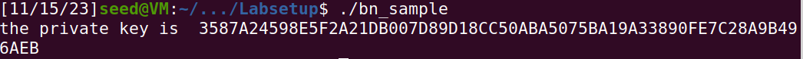
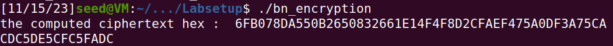
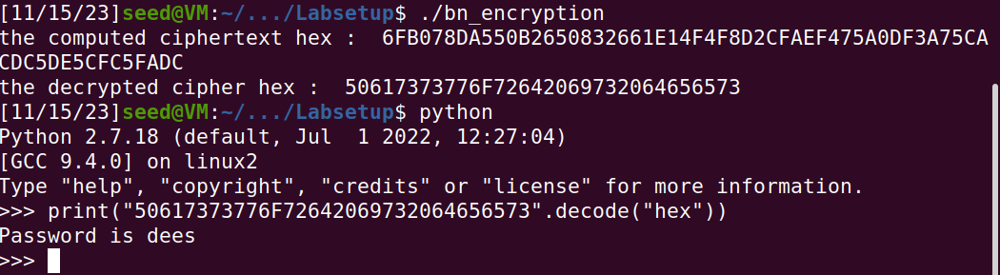
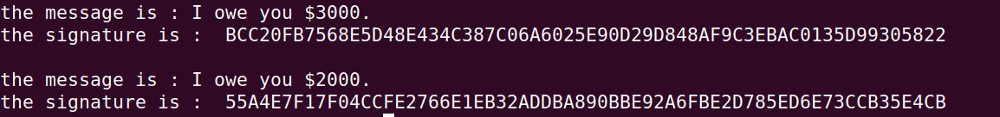
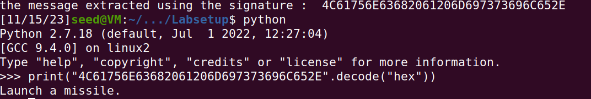

# LAB 8 - Asymetric encryption and the RSA algorithm

## RSA algorithm

The RSA algorithm is a widely used asymmetric cryptographic system that relies on the computational difficulty of factoring large numbers. The process of generating a private key in RSA involves several steps:

### Step 1: Choose Two Prime Numbers (p and q)
- **p and q:** Select two large prime numbers. These are the core of the RSA algorithm's security.

### Step 2: Calculate the Modulus (n)
- **n:** Calculate the modulus `n` by multiplying `p` and `q`. This value is used in both the public and private keys.
  ```
  n = p * q
  ```

### Step 3: Compute Euler's Totient Function (φ(n))
- **φ(n):** Calculate Euler's totient function, which is the product of one less than each of the chosen primes.
  ```
  φ(n) = (p-1) * (q-1)
  ```

### Step 4: Choose the Public Exponent (e)
- **e:** Choose a public exponent `e` that is co-prime to `φ(n)` and less than `φ(n)`. A common choice for `e` is 65537.

### Step 5: Calculate the Private Exponent (d)
- **d:** Calculate the private exponent `d`, which is the modular multiplicative inverse of `e` modulo `φ(n)`. This forms the private key.
  ```
  d * e ≡ 1 (mod φ(n))
  ```

### Key Components
- **Public Key:** The public key is composed of `e` and `n`.
- **Private Key:** The private key is composed of `d` and `n`.

### Notes
- The security of RSA is based on the difficulty of factoring the large number `n` into its prime factors `p` and `q`.
- In practice, the values of `p` and `q` should be large enough (at least 512 bits) to ensure security.





## task 2 : encrypting a message

RSA encryption is a fundamental part of the RSA asymmetric cryptographic algorithm, which is widely used for secure data transmission. The process involves the public key, which is made up of the modulus (n) and the public exponent (e). Here's an overview of how the encryption process works:

### Step 1: Convert the Message to a Number

- **Message Conversion:** The plaintext message (M) is converted into a number (m) that is smaller than the modulus (n). This is often achieved through a padding scheme, which also enhances security.

### Step 2: Compute the Ciphertext
- **Ciphertext Calculation:** The ciphertext (c) is computed using the formula:
  ```
  c = m^e mod n
  ```
  This involves raising the message number (m) to the power of the public exponent (e) and then taking the modulus (n).

### Step 3: Transmit the Ciphertext
- **Transmission:** The resulting ciphertext (c) is transmitted or stored. It can only be decrypted by the corresponding private key.

### Step 4: Decryption Process (For Context)
- **Decryption by Private Key:** The recipient, who has the private key, decrypts the message by raising the ciphertext (c) to the power of their private exponent (d) and taking the modulus (n):
  ```
  m = c^d mod n
  ```
- **Message Recovery:** The original message (m) is recovered and can be converted back to plaintext.



## Task 3 : Decrypting a message

Using the decryption process :   
```
  m = c^d mod n
```
and then converting the resulting hex value to ascii we find that the plaintext is **password is dees**



## Task 4 : signing a message

Signing and encrypting a message serve different purposes.

-  Encryption is used to conceal the content of a message from anyone except the intended recipient. It involves transforming the message using the recipient's public key, ensuring that only the recipient can decrypt it with their private key. 
- **On the other hand, signing a message is about proving the authenticity and integrity of the message.** When a message is signed, the sender creates a digital signature using their private key. This signature can be verified by anyone with the sender's public key, confirming that the message truly comes from the sender and has not been altered in transit. While encryption protects the confidentiality of a message, signing establishes trust and authenticity.

- a signature is created using the following formula:
```
S = M^d mod n
```
### result


The difference in the messages leads to different signatures. This is because even a small change in the input (the message) results in a completely different output when encrypted with RSA.

## Verifying a signature

Alice sent a message M and a signature S to Bob, Bob has also access to Alice's public key (e,n)

We can verify the signature S using the following formula:

`M' = S^e mod n`

Where:
- `M'` is the result of the verification process.
- `S` is the signature to be verified.
- `e` is the public exponent.
- `n` is the modulus.

Verification Steps:

1. **Decrypt the Signature:**
   - The signature `S` is decrypted by raising it to the power of `e` and taking the modulus `n`. This operation gives you `M'`, which should match the original message or its representation.

2. **Compare with the Original Message:**
   - If `M'` matches the original message `M`, the signature is considered to be authentic.



## Manually Verifying an X.509 Certificate

Purpose of c0 and c1 Certificates:

- c0: This is the certificate of the server (e.g., www.example.org). It contains the server's public key and other identifying information. This certificate is issued by a Certificate Authority (CA).

- c1: This is the certificate of the intermediate CA. It's used to bridge trust between the server's certificate (c0) and the root CA. This intermediate certificate confirms the authenticity of the server's certificate.

- Relationship Between c0 and c1:
  The server's certificate (c0) is signed by the intermediate CA, whose certificate is c1. The issuer field in c0 corresponds to the subject field in c1, indicating that c1 (the intermediate CA) has issued and signed c0.

- Verifying the Signature:

  - Using the public key extracted from c1, you decrypt the signature extracted from c0. This should yield a hash value.
  Compare this decrypted hash with the hash you computed from the certificate body. If they match, it means the certificate is valid, i.e., it was indeed signed by the CA and has not been tampered with.  
